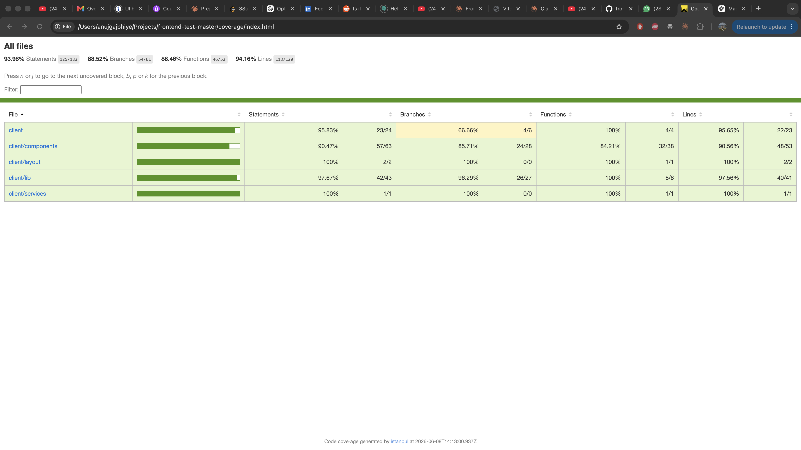

# Query Builder

[](https://github.com/AnujGajbhiye2/frontend-test-master/actions/workflows/ci.yml)

A dynamic query builder built with **React + TypeScript + Vite**, backed by a lightweight **Express** server. Users compose nested rule groups — each rule a `Field Name` / `Operation` / `Value` triple — and submit them as a JSON payload matching the required schema.

## Features

- **Combinators** (`AND` / `OR`) on every group, root and nested.
- **Add Rule / Add Group** — build arbitrarily deep, hierarchical conditions.
- **Field-aware widgets** — the Value input changes by field type:
  - `amount` → numeric input + currency dropdown (`{ amount, currency }`)
  - `transaction_state` → enum dropdown
  - `installments` → numeric input
  - `name` / `id` / `device_ip` → text input
- **Operation list adapts to field type** — text/enum fields get `EQUAL` / `NOT_EQUAL`; numeric fields add `LESS_THAN` / `GREATER_THAN`.
- **Validation** — field-level (on blur) and form-level (blocks submit, highlights invalid fields).
- **Live JSON output** — submitted payload rendered on the page.
- **Persisted to backend** — `POST /api/save-rules`.
- **Accessible** — labelled controls, `aria-invalid` / `aria-describedby` on inputs, `role="alert"` on errors.

## Prerequisites

- Node.js 20.12+
- npm 10.5+

## Getting Started

```bash
npm install      # installs deps and sets up the husky git hook
npm run start    # runs client (Vite) + server (Express) together
```

- Client: http://localhost:5173
- Server: http://localhost:3000 (Vite proxies `/api` → `:3000`)

Submitted rules are written to `rules.json` at the project root by the server.

## Scripts

| Script | Purpose |
|--------|---------|
| `npm run start` | Run client + server concurrently |
| `npm run dev` | Client only (Vite) |
| `npm run dev:server` | Server only (nodemon) |
| `npm run build` | Type-check + production build |
| `npm test` | Run tests (watch mode) |
| `npm run coverage` | Run tests once with coverage report |
| `npm run lint` | ESLint (client only) |
| `npm run format` | Prettier write |
| `npm run format:check` | Prettier check (no writes) |

## Architecture

```
src/client/
├── App.tsx                 # root state, submit/reset, JSON output panel
├── components/
│   ├── Group.tsx           # recursive group: combinator + add buttons + children
│   ├── Rule.tsx            # field/operation selects + per-rule error state
│   ├── ValueWidget.tsx     # renders the value input by field type
│   └── ui/                 # shadcn primitives
├── layout/AppShell.tsx     # header, page layout, toast host
├── lib/
│   ├── constants.ts        # field names, operation maps, defaults, factories
│   ├── utils.ts            # validate, hasError, serialize, cn
│   └── apiClient.ts        # axios wrapper (typed post, abort, error mapping)
├── services/rulesService.ts# saveRules — service layer over apiClient
└── types/RuleTypes.ts      # discriminated unions + serialized schema types
```

### Key design decisions

- **Discriminated unions** (`TextRule | NumericRule | CurrencyRule | EnumRule`) model the rule shapes. TypeScript narrows on `fieldName`, so each branch knows its exact value type.
- **Extensible value widgets** — adding a new field type means one new union member + one branch in `ValueWidget`. The rest (operations, defaults, validation) is data-driven via maps in `constants.ts`.
- **Recursive `Group`** — groups render groups, so nesting is unbounded with no special-casing.
- **State lifted to `App`** — a single immutable `RuleGroupType` tree; child updates flow up via a `childSetter` that rebuilds the path. Prop drilling is acceptable at this scale; no state library needed.
- **Pure logic in `utils.ts`** — `validate` / `hasError` / `serialize` are pure and unit-tested independently of the UI.
- **Service layer** — components call `saveRules()`, not URLs. The axios wrapper centralises base URL, headers, abort handling, and error formatting.
- **In-flight request cancellation** — re-submitting aborts the previous request via `AbortController`.

## Testing

```bash
npm run coverage
```

- React Testing Library + Vitest, Istanbul coverage.
- Coverage gate at **80%** across statements/branches/functions/lines (enforced in `vite.config.ts`).
- A husky **pre-commit** hook runs lint, format check, and coverage before every commit.

<!-- Coverage screenshot -->


## Continuous Integration

A GitHub Actions workflow ([`.github/workflows/ci.yml`](.github/workflows/ci.yml)) runs on every push and pull request:

1. Install dependencies (`npm ci`)
2. Lint (`npm run lint`)
3. Format check (`npm run format:check`)
4. Test + coverage (`npm run coverage`) — fails the build if coverage drops below 80%

This mirrors the local pre-commit hook, so anything that passes locally passes in CI.

## Known limitations

- **Deep nesting on small screens** — heavily nested groups can overflow horizontally on narrow viewports. The fields wrap on mobile, but very deep trees may still clip. Acceptable tradeoff for the exercise; a horizontal scroll container or a depth cap could address it.
- **New rules are grouped above nested groups** — when adding a rule to a group that already contains nested groups, the rule is placed after existing rules but before the groups (keeps flat rules visually together). This reorders them in the payload relative to strict append order.
- **Server is unmodified** — per the brief, `src/server` is untouched; it persists the payload to `rules.json`.
```
